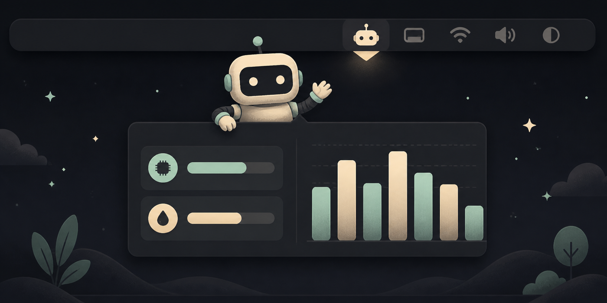
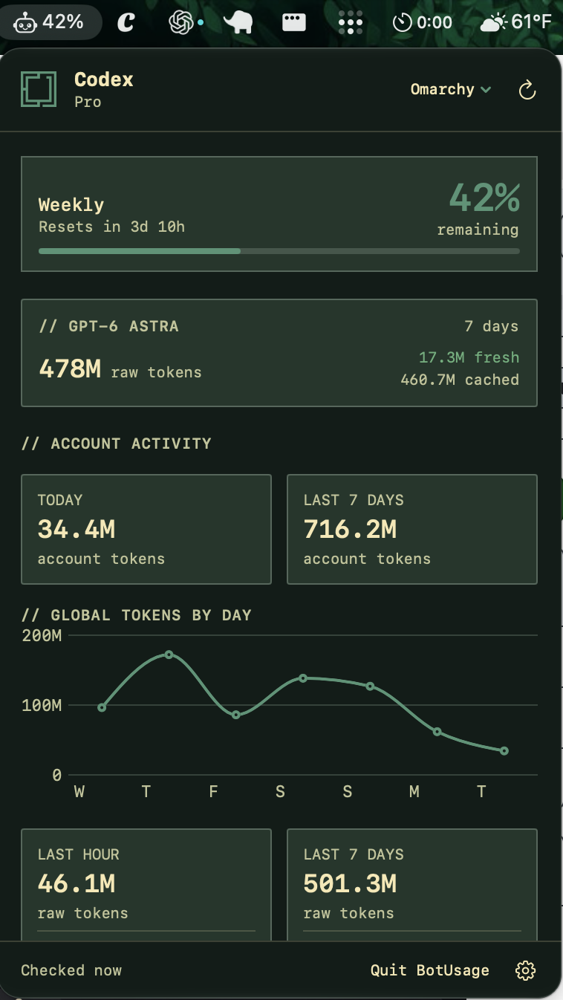

  

# BotUsage

Codex, Claude Code, and Grok Build usage, one click from your Mac's menu bar.

BotUsage shows available quota windows and local token activity by model for each provider, plus Codex's official daily totals. Choose a provider tab or open Combined to see all three together. It stays out of the Dock, refreshes while it runs, and offers five themes: macOS, Osaka Jade, Codex, Claude, and Ox Blood.

**[Download the latest release](https://github.com/corith/bot-usage/releases/latest)** · **[Release notes](https://github.com/corith/bot-usage/releases)** · **[Report an issue](https://github.com/corith/bot-usage/issues)**

**Version 0.2.9 (build 11)** adds the Claude theme and more reliable Claude limit tracking.

## Requirements

- **macOS 14 Sonoma or later**, on Apple silicon or Intel. One universal download supports both.
- Install and sign in to the providers you want to view: **Codex Desktop or the Codex CLI**, **Claude Code**, and/or **Grok Build**. You do not need all three installed.

## Install

1. Download the latest universal ZIP from **[Releases](https://github.com/corith/bot-usage/releases/latest)**.
2. Unzip the download and move **BotUsage.app** to **Applications**.
3. Open the app. Use the bot icon in the menu bar to view your usage.

### First launch

Version 0.2.9 is **Developer ID signed and notarized by Apple**, with its notarization ticket attached to the app.

macOS may ask you to confirm that you want to open an app downloaded from the internet. Choose **Open** to continue. See [Apple's guidance on opening downloaded apps](https://support.apple.com/102445).

  

## Updates

Open the **Settings** gear in the panel footer and choose **Check for Updates…**. You can also opt in to automatic update checks in Settings.

Updates use Sparkle and this public repository. **No GitHub account or access token is required.** Sparkle checks the signed update feed and verifies the downloaded update before installing and relaunching BotUsage.

**Settings crashes in 0.2.5 or 0.2.6?** Version 0.2.7 fixes this crash. Quit BotUsage, download the [latest ZIP](https://github.com/corith/bot-usage/releases/latest), and replace **BotUsage.app** in **Applications** manually before reopening it.

**Upgrading from 0.2.4 or earlier?** Download and install the latest version manually once. Earlier builds check the previous private repository; 0.2.5 and later use this public update channel.

## Reading your usage

- **Quota windows** show each provider's available allowance and reset times, including model-specific Claude weekly limits when reported. Hover for details.
- **Official daily totals** come from your signed-in Codex account, when available.
- **Local raw activity** comes from provider session history on this Mac. It shows recent activity, model breakdowns, and each provider's most-used identified model, so it can differ from account-wide totals. Unattributed activity remains in the totals.
- **Combined** keeps allowances separate and estimates total local tokens over the last seven calendar days and rolling last hour. Missing or incomplete histories are labeled; provider percentages and billing costs are not added together.

Raw tokens are input plus output, including cached input. Repeated use of conversation context counts again. **Fresh** tokens exclude cached input. Local token counts are diagnostic activity totals, not a bill or a measure of remaining subscription allowance. Missing or unreadable history can produce incomplete totals; BotUsage displays a warning when it detects this.

BotUsage uses each installed provider's existing sign-in to request allowance data and reads local session history. Claude and Grok requests do not send a model prompt or start a coding conversation. It contacts GitHub for update checks and downloads.

## Make it yours

Choose a theme from the panel's dropdown or **Settings → Theme**. The new **Claude** theme uses orange accents with cream surfaces in Light Mode and warm dark surfaces in Dark Mode, following your Mac's appearance automatically. **macOS** also follows system appearance; **Osaka Jade**, **Codex**, and **Ox Blood** stay dark. Osaka Jade and Ox Blood are the new names for Omarchy and Demon; saved theme choices carry forward. Use **Settings → Status Bar %** to select Codex, Claude Weekly, Claude 5h, or Grok Build independently of the open tab. Enable **Open at Login** in Settings to start BotUsage when you sign in to your Mac; keep the app in Applications first.

The panel fits the available screen height while its metrics scroll. Click the centered **cmd Q** footer button or press **Command-Q** while the app is active to quit.

Data normally refreshes every five minutes. Opening the panel attempts a Claude refresh, with a one-minute cooldown after success and longer retry delays after failures. Claude keeps account-matched last-known readings with their original age; verified model limits survive temporary failures, and newer readings saved by another Claude session are picked up automatically. A passed reset is labeled. Codex and Grok also retain prior limits after temporary failures, with freshness and reset rules preventing stale percentages from appearing in the menu bar.

Use the refresh button to check the selected tab, or all providers from Combined. If allowance data is unavailable, update and sign in to the relevant provider, then refresh. Settings can remove the previous Claude status-line connection if you used an earlier preview; it is no longer required.

## Support

[Open an issue](https://github.com/corith/bot-usage/issues) with your BotUsage version, macOS version, and a description of what happened. Please remove account details and other personal information from screenshots or logs.

This repository hosts public downloads, release notes, and support. BotUsage's application source remains private. See [third-party notices](THIRD-PARTY-NOTICES.md) for the components included in the app.
